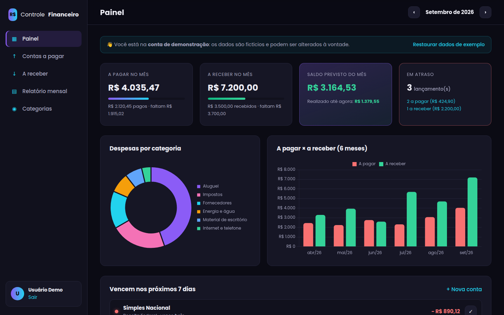
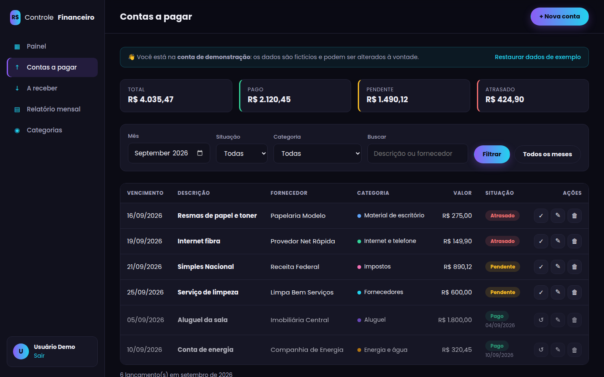
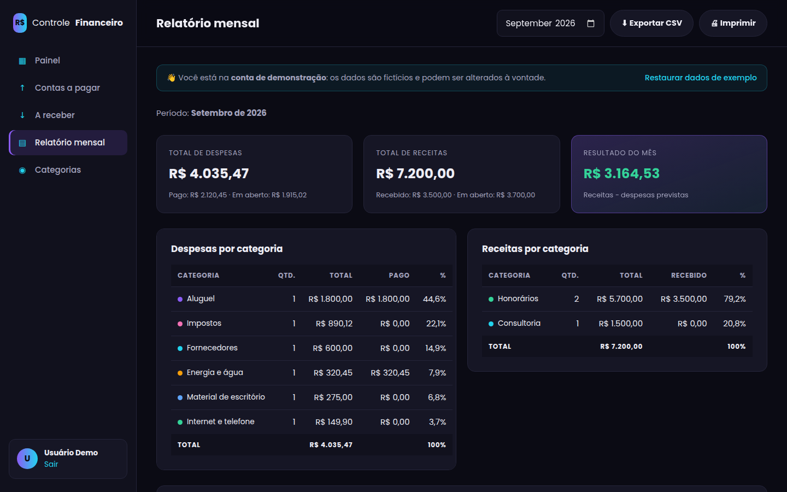
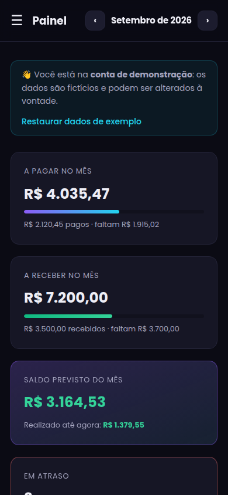

# 💰 Controle Financeiro

Sistema web para controlar **contas a pagar** e **valores a receber**, com painel de indicadores, alertas de vencimento, gráficos e relatório mensal exportável para Excel.

Desenvolvido com **PHP, MySQL, HTML, CSS e JavaScript puro**, sem frameworks, para praticar a base do desenvolvimento web back-end e front-end.

🔗 **Demo online:** https://mariana-financeiro.infinityfreeapp.com · Login de teste: `demo@controlefinanceiro.com` / `demo123`



## ✨ Funcionalidades

- **Login e cadastro de usuários**: senhas criptografadas; cada pessoa vê só os próprios dados.
- **Contas a pagar e a receber**: cadastrar, editar, excluir e marcar como pago/recebido com um clique.
- **Situação automática**: *pendente*, *atrasado* (venceu e não foi quitado) ou *pago/recebido*.
- **Filtros**: por mês, situação, categoria e busca por descrição ou fornecedor/cliente.
- **Painel**: totais do mês, saldo previsto e realizado, itens em atraso e vencimentos dos próximos 7 dias.
- **Gráficos** (Chart.js): despesas por categoria e comparação a pagar × a receber nos últimos 6 meses.
- **Relatório mensal**: resumo por categoria com percentuais, **exportação CSV** (abre no Excel) e versão para impressão.
- **Categorias personalizadas** com cores.
- **Conta de demonstração** com dados fictícios sempre atualizados e botão para restaurá-los.
- **Responsivo**: no celular, o menu vira gaveta e as tabelas viram cartões.

| Contas a pagar | Relatório mensal | Celular |
|---|---|---|
|  |  |  |

## 🔒 Segurança aplicada

| Risco | Proteção |
|---|---|
| SQL Injection | PDO com consultas preparadas em todas as queries |
| XSS | Todo dado exibido passa por `htmlspecialchars` (função `e()`) |
| CSRF | Token secreto em todos os formulários que alteram dados |
| Senhas vazadas | `password_hash` / `password_verify` (bcrypt) |
| Sequestro de sessão | `session_regenerate_id` no login e cookie `HttpOnly` + `SameSite` |
| Acesso a dados de outro usuário | Toda consulta filtra por `usuario_id` |
| Acesso direto a arquivos internos | `.htaccess` bloqueando `includes/` e `database/` |

## 🗂️ Estrutura

```
controle-financeiro/
├── index.php               # redireciona para login ou painel
├── login.php / cadastro.php / logout.php
├── painel.php              # indicadores e gráficos
├── lancamentos.php         # lista com filtros (a pagar / a receber)
├── lancamento_form.php     # cadastro e edição
├── lancamento_acao.php     # pagar, reabrir e excluir
├── relatorio.php           # relatório mensal + CSV
├── categorias.php
├── demo_restaurar.php
├── includes/               # configuração, conexão, autenticação e funções
├── assets/css/style.css
├── assets/js/app.js        # menu, máscara de moeda, confirmações e gráficos
├── database/schema.sql     # estrutura do banco
├── database/seed.sql       # usuário de demonstração
└── docs/                   # imagens deste README
```

### Modelo de dados

```
usuarios (1) ──< categorias (N)
usuarios (1) ──< lancamentos (N) >── (0..1) categorias
```

A tabela `lancamentos` guarda contas a pagar e a receber, separadas pela coluna `tipo`. A situação não é gravada: é calculada a partir de `vencimento` e `data_quitacao`, então nunca fica desatualizada.

## ▶️ Como rodar no computador (XAMPP)

1. Instale o [XAMPP](https://www.apachefriends.org/pt_br/) e inicie **Apache** e **MySQL** no painel dele.
2. Copie a pasta `controle-financeiro` para `C:\xampp\htdocs\`.
3. Abra `http://localhost/phpmyadmin`, crie um banco chamado **controle_financeiro** (agrupamento `utf8mb4_unicode_ci`).
4. Com o banco selecionado, vá em **Importar** e importe `database/schema.sql`. Depois importe `database/seed.sql`.
5. Acesse `http://localhost/controle-financeiro` e entre com `demo@controlefinanceiro.com` / `demo123`.

As configurações padrão do XAMPP (usuário `root`, sem senha) já estão em `includes/config.php`.

## 🌐 Como publicar online (InfinityFree, gratuito)

1. Crie uma conta em [infinityfree.com](https://www.infinityfree.com) e uma nova hospedagem (subdomínio grátis).
2. No painel, crie um **banco MySQL** e anote host, nome do banco, usuário e senha.
3. Abra o **phpMyAdmin** da hospedagem e importe `schema.sql` e `seed.sql`.
4. Copie `includes/config.local.exemplo.php` para `includes/config.local.php` e preencha com os dados do passo 2.
5. Envie todos os arquivos para a pasta `htdocs` pelo **Gerenciador de Arquivos** (ou FTP).
6. Acesse o seu subdomínio.

> `config.local.php` contém a senha do banco e está no `.gitignore`: ele **nunca** deve ir para o GitHub.

## 🛠️ Tecnologias

PHP 7.4+ (testado no 8.4) · MySQL/MariaDB · PDO · HTML5 · CSS3 (Grid, Flexbox, media queries) · JavaScript · Chart.js

## 👩‍💻 Autora

**Mariana da Silva Ramos**: tecnóloga em Análise e Desenvolvimento de Sistemas e administradora.
[Portfólio](https://marianaramosti.github.io/portfolio) · [LinkedIn](https://www.linkedin.com/in/mariana-ramos-9b3014151/) · [GitHub](https://github.com/marianaramosti)
